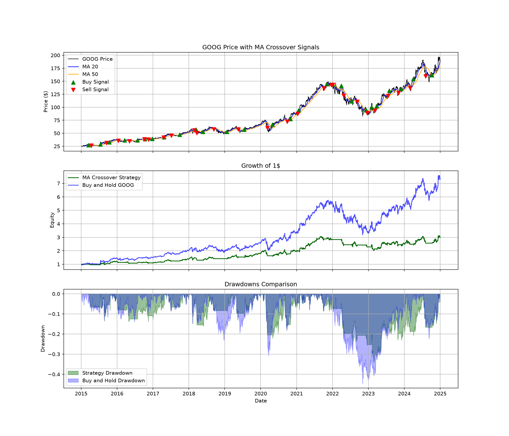

# Moving Average Crossover Strategy Backtester

My first quant finance project — testing whether a simple moving average crossover strategy can beat just buying and holding Google (GOOG) stock.

## Why I built this

I've been trading Forex for a few years, so I already understood concepts like entries, exits, stop-loss, and backtesting from a practical side. Going into a Computer Science + AI/ML degree, I wanted to combine that trading background with actual programming and start building a real quant portfolio — this is the first project in that journey.

I picked the moving average crossover strategy because it's one of the oldest, simplest systematic trading ideas: buy when a short-term average price crosses above a long-term average, sell when it crosses back below. Simple enough to build as a beginner, but with enough real substance (look-ahead bias, risk metrics, benchmarking) to actually learn from.

## What the project does

1. Downloads 10 years of daily GOOG price data (2015–2024) using `yfinance`
2. Cleans the data and checks it for missing values
3. Calculates a 20-day and 50-day moving average
4. Generates buy/sell signals whenever the 20-day average crosses the 50-day average
5. Backtests those signals against actual historical prices
6. Compares the strategy's performance to simply buying and holding GOOG the whole time
7. Calculates real performance metrics — CAGR, volatility, Sharpe ratio, and max drawdown — instead of just eyeballing a chart

## What I found

| Metric | Strategy | Buy & Hold |
|---|---|---|
| CAGR | 11.63% | 22.30% |
| Annualized Volatility | 21.12% | 28.50% |
| Sharpe Ratio | 0.63 | 0.84 |
| Max Drawdown | -34.12% | -44.60% |





Honestly, the strategy lost to just holding the stock. At first that felt like a failure, but digging into *why* taught me more than if it had magically "won." GOOG spent most of the last 10 years in a strong uptrend, and this strategy sits out of the market during choppy periods — so it avoided some of the worst drawdowns (34% max drawdown vs 45% for buy-and-hold) but also missed part of the recovery every time it re-entered late. That's a well-known, real trade-off in trend-following strategies, not a bug in my code.

I think this is actually a stronger result to show in an interview than a strategy that "beats the market" — because a backtest that beats the market on the first try is usually a red flag for a hidden bug (like look-ahead bias) rather than real skill.

## How the strategy avoids cheating (look-ahead bias)

One of the more important things I learned: you can't act on a signal the same day it happens, because in real life you wouldn't know the day had closed as a crossover until after the fact. So every signal is shifted forward by one day before the backtest uses it — meaning the strategy only ever trades on yesterday's confirmed signal, never today's.

## Project structure

```

ma-crossover-backtester/
├── data/           # raw and cleaned price data, plus backtest results
├── images/         # the final combined chart used in this README
├── results/        # EDA charts and a performance metrics CSV
├── src/            # all the actual code, one script per step
├── requirements.txt
├── LICENSE
└── README.md
```

## How to run it yourself

```bash
git clone https://github.com/anushragav-vs/ma-crossover-backtester.git
cd ma-crossover-backtester
python -m venv venv
venv\Scripts\activate
pip install -r requirements.txt
```

Then run each script in order:

```bash
python src/get_data.py
python src/clean_data.py
python src/eda.py
python src/strategy.py
python src/backtest.py
python src/metrics.py
python src/visualize.py
```

## What this doesn't account for (yet)

- No transaction costs or slippage — a real account would do worse than this backtest shows, since every crossover is a real trade with real fees, while buy-and-hold never trades at all
- Only tested on one stock (GOOG) — I haven't checked if this holds up on other assets
- The 20/50-day windows weren't optimized or tested on unseen data, so there's no walk-forward validation yet
- Backtested results are not a guarantee of anything in live trading

## What I'd add next

- Transaction costs and slippage
- Testing on more than one stock
- Walk-forward/out-of-sample validation
- Trying different moving average windows to see what actually matters
- Position sizing and stop-loss/take-profit rules

## Tools used

Python 3.11, pandas, NumPy, matplotlib, yfinance

## Disclaimer

This is a learning project, not financial advice. Backtested performance says nothing about how a strategy will perform in the future.

## Author

Anush Ragav V S — first-year AI/ML student, building toward a career in quantitative trading/research.
```
